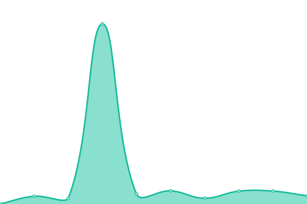

# [📈 Live Status](https://ACED-IDP.github.io/status-monitor): <!--live status--> **🟧 Partial outage**

This repository contains the open-source uptime monitor and status page for [ACED-IDP](https://ACED-IDP.github.io/status-monitor), powered by [Upptime](https://github.com/upptime/upptime).

With [Upptime](https://upptime.js.org), you can get your own unlimited and free uptime monitor and status page, powered entirely by a GitHub repository. We use [Issues](https://github.com/ACED-IDP/status-monitor/issues) as incident reports, [Actions](https://github.com/ACED-IDP/status-monitor/actions) as uptime monitors, and [Pages](https://ACED-IDP.github.io/status-monitor) for the status page.

<!--start: status pages-->
<!-- This summary is generated by Upptime (https://github.com/upptime/upptime) -->
<!-- Do not edit this manually, your changes will be overwritten -->
<!-- prettier-ignore -->
| URL | Status | History | Response Time | Uptime |
| --- | ------ | ------- | ------------- | ------ |
|  [ACED-IDP Portal (Development)](https://development.aced-idp.org) | 🟩 Up | [aced-idp-portal-development.yml](https://github.com/ACED-IDP/status-monitor/commits/HEAD/history/aced-idp-portal-development.yml) | 

 609ms
     
 | 

<a href="https://ACED-IDP.github.io/status-monitor/history/aced-idp-portal-development">100.00%</a>
    

|  [ACED-IDP Portal (Production/Legacy)](https://aced-idp.org) | 🟥 Down | [aced-idp-portal-production-legacy.yml](https://github.com/ACED-IDP/status-monitor/commits/HEAD/history/aced-idp-portal-production-legacy.yml) | 

 565ms
     
 | 

<a href="https://ACED-IDP.github.io/status-monitor/history/aced-idp-portal-production-legacy">100.00%</a>
    

|  [ACED-IDP User Documentation](https://aced-idp.github.io) | 🟩 Up | [aced-idp-user-documentation.yml](https://github.com/ACED-IDP/status-monitor/commits/HEAD/history/aced-idp-user-documentation.yml) | 

 110ms
     
 | 

<a href="https://ACED-IDP.github.io/status-monitor/history/aced-idp-user-documentation">100.00%</a>
    

<!--end: status pages-->

[**Visit our status website →**](https://ACED-IDP.github.io/status-monitor)

## 📄 License

- Powered by: [Upptime](https://github.com/upptime/upptime)
- Code: [MIT](./LICENSE) © [ACED-IDP](https://ACED-IDP.github.io/status-monitor)
- Data in the `./history` directory: [Open Database License](https://opendatacommons.org/licenses/odbl/1-0/)
